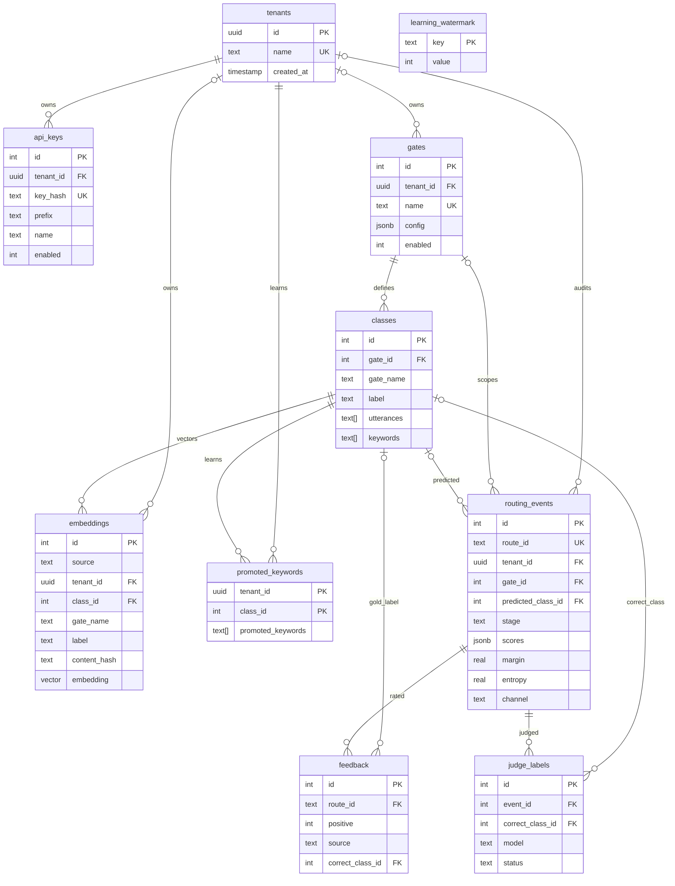
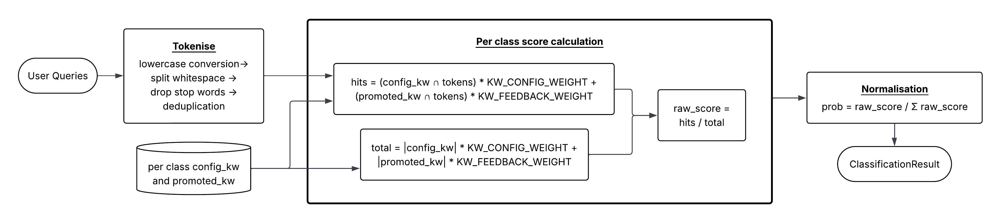
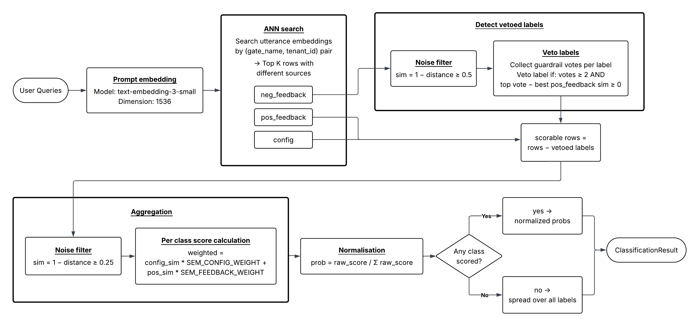
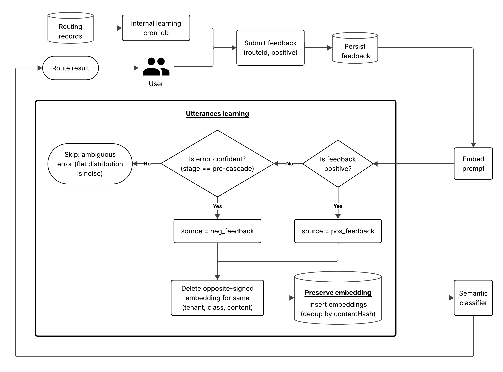
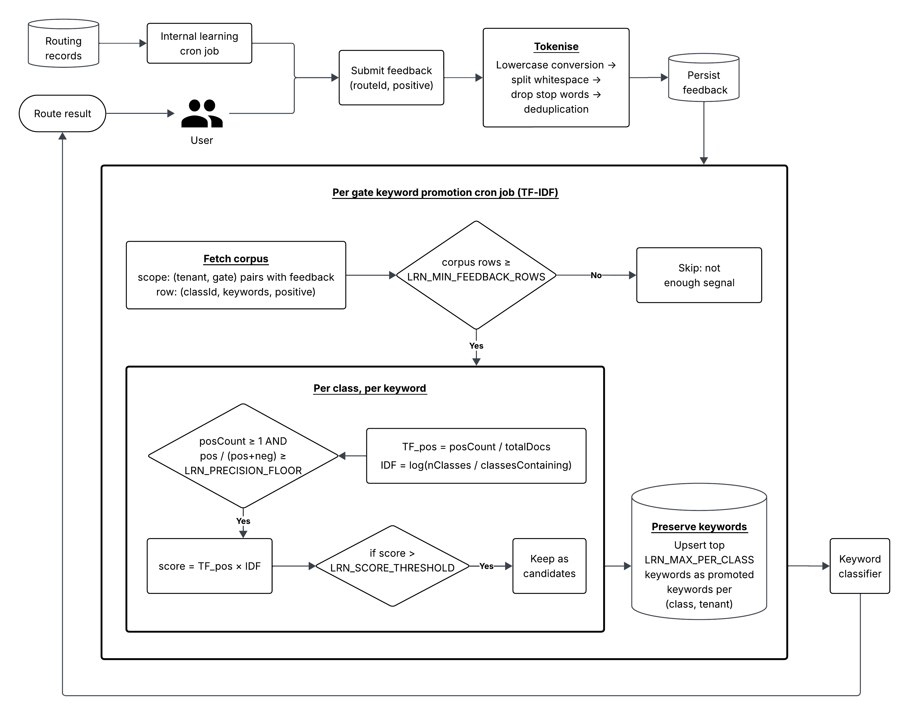

# Architecture

This document describes the system design of the intent router: its entry points, database schema, routing pipeline, online-learning loop, and deployment.

## Overview

The service is a single Node.js/TypeScript process containerised by Docker. It exposes its
functionality over HTTP and delegates all persistence to a PostgreSQL database with the `pgvector`
extension. Two production entry points — the LiteLLM classifier lane and the MCP lane — converge on
one service layer, routing cascade, and store; a REST surface with per-tenant API keys is preserved
but is not the intended production path.

All entry points resolve the caller to a **tenant id** before any routing work happens. The MCP
server runs in the same process as the application (on its own port) so its tool handlers call the
shared service functions directly, avoiding a second deployment and a network hop.

External dependencies: the LiteLLM proxy plays two roles. As a *client*, it forwards
chat-completion routing requests to the router's OpenAI-compatible surface and the MCP lane; as an
*upstream dependency*, it is the single gateway through which the router reaches the hosted
language and embedding models.

## Entry points

| Entry point | Framework | Channel (`routing_events.channel`) | Auth |
| ----------- | --------- | ---------------------------------- | ---- |
| LiteLLM     | Fastify   | `litellm`                           | `intent-router-token` + `intent-router-tenant` headers |
| MCP         | FastMCP   | `mcp`                               | `intent-router-token` + `intent-router-tenant` headers |
| REST        | Fastify   | `rest`                              | `Authorization: Bearer <api-key>` |

The LiteLLM and MCP lanes share one service token (`LITELLM_PROXY_TOKEN`) and identify tenants by
the LiteLLM API key hash; with `AUTO_CREATE_TENANT=true`, an unknown tenant is provisioned on first
use. The REST lane and its API keys are kept for future use but are not the production path.

The REST and LiteLLM surfaces are Fastify plugins registered during bootstrap; the MCP server is a
separate instance started in the same process. HTTP-facing packages follow a three-file split —
`routes.ts` (endpoints), `schema.ts` (Zod validation), `service.ts` (business logic) — while
`store/` isolates all database access behind the Drizzle schema.

## Database design

Persistence is a PostgreSQL database accessed through Drizzle ORM, pairing a relational core with
a pgvector vector store, all scoped per tenant:



- **`tenants`** roots the ownership hierarchy. UUID identifiers are used for tenants; all other
  tables use compact integer ids. Throughout the schema, `tenant_id = NULL` marks a shared,
  system-wide row.
- **`api_keys`** holds credentials for the REST lane only (hashed with SHA-256); the LiteLLM and
  MCP lanes do not use these.
- **`gates`** / **`classes`** hold the routing taxonomy. `classes.gate_name` is denormalised so the
  hot-path `(gate_name, label)` lookup needs no join. `gates.config` (`jsonb`) carries per-gate
  routing configuration such as `learningEnabled`.
- **`embeddings`** stores the semantic classifier's searchable vectors, tagged by `source`
  (`config`, `pos_feedback`, or `neg_feedback`).
- **`routing_events`** is the audit trail: one row per routing request, with the deciding `stage`
  (`pre-cascade`, `llm`, or `historical`), the pre-cascade `scores` distribution (NULL when no
  pre-cascade ran), the pre-cascade `margin` and `entropy` used for escalation and judge ranking,
  and the entry `channel`.
- **`feedback`** closes the loop with a `positive` flag plus a `source` (`user` or `judge`) and a
  `correctClassId` that the judge fills in as its gold label.
- **`promoted_keywords`** stores the TF-IDF-promoted keywords per (tenant, class), consumed by the
  keyword classifier.
- **`judge_labels`** records each judge verdict (event, correct class, model, status) for auditing
  and bias monitoring.
- **`learning_watermark`** stores the incremental cursors (e.g. `judge_last_event_id`) that the
  async learning passes advance so they never re-label the same rows.

Ownership tables (`api_keys`, `gates`, `classes`, `embeddings`, `promoted_keywords`) use
`ON DELETE CASCADE`; the audit table uses `ON DELETE SET NULL`, so deleting a tenant, gate, or
class keeps routing history but nulls the reference. Writes that touch denormalised columns are
grouped into a single transaction.

## Routing pipeline

The cascading router chains three classifiers behind one interface, each returning a per-class
probability distribution plus the evidence behind it:

```ts
export interface Classifier {
  readonly name: ClassifierMode;
  classify(prompt: string, gate: Gate, tenantId: string): Promise<ClassificationResult>;
}
```

### Keyword classifier (cheapest)



Tokenises the prompt, drops stopwords, and scores each class as the fraction of its keywords that
appear — configured keywords weighted 2.0× against promoted keywords at 1.0×, so learned keywords
cannot drown out the configured ones.

### Semantic classifier



Embeds the prompt with the configured embedding model, runs a top-K nearest-neighbour search over
the class-utterance vectors scoped to the gate-tenant pair, and aggregates thresholded
similarities into a normalised distribution. Negative-feedback embeddings act as **veto
guardrails**: a guardrail suppresses an intent when it clears a similarity threshold and beats the
class's best positive embedding by a margin. If no neighbour clears the threshold, probability is
spread over the returned neighbours so the cascade sees honest uncertainty.

### LLM classifier (fallback)

Prompts a language model to reply with the **bare label** (no JSON schema), parsed by regex, with
up to three attempts before giving up. The label-only design avoids the reasoning degradation of
strict structured output on small, self-hosted models and sidesteps their unreliable calibrated
confidence.

### Cascade


1. Run the keyword and semantic classifiers in parallel — only those with configured signal — and
   blend their normalised distributions linearly (`kw × 0.3 + sem × 0.7`).
2. **Confidence gate:** escalate to the LLM when the relative top-1/top-2 margin is below
   `CAS_MARGIN_THRESHOLD` or the normalised entropy is above `CAS_ENTROPY_THRESHOLD`.
3. **Agreement gate:** escalate when the two classifiers are each individually confident but
   disagree on the top class.
4. If the LLM yields no usable label, degrade to the pre-cascade result, then to the
   most-frequent historical class for the (gate, tenant) pair.

A safety net short-circuits straight to the LLM when a gate has neither keywords nor utterances
configured.

## Online learning

Learning refines the two cheap classifiers only; the LLM classifier stays static. Two signal
sources feed the same two mechanisms:

- **User feedback** — `POST /api/feedback` (REST) or `submit_feedback` (MCP) with a `routeId` and
  a `positive` flag. Explicit: the caller confirms or corrects a decision.
- **Internal learning** — the offline LLM-as-judge pass (`scripts/internal-learning.ts`) labels
  routing events that never received user feedback, so learning does not stall when nobody rates
  results. Its labels are written as judge-source feedback with a gold class.

The feedback row is always written before any learning work, and the learning steps are
best-effort, so the audit trail survives even when learning fails.

**Semantic learning** (runs immediately on feedback receipt). The prompt is embedded once and
written as a learned vector:

- positive signal (`positive=true`, or the judge's gold class) → a `pos_feedback` embedding that
  pulls the class closer to the prompt;
- negative signal (`positive=false`, or the judge disagreeing with the prediction) → a
  `neg_feedback` guardrail for the wrongly-predicted class. User negative feedback is gated so only
  confident errors learn: a pre-cascade miss must clear `LRN_NEG_MARGIN`, while an LLM/historical
  miss always counts as confident because the model committed to a bare label. At query time a
  guardrail vetoes that class when it clears a similarity threshold and beats the class's best
  positive embedding by a margin, so it needs a couple of independent votes (`LRN_MIN_VOTES`)
  before it fires.

Each write flips any opposite-signed evidence for the same utterance, so contradictory evidence
cannot coexist.



**Keyword learning** (scheduled cron, `cron.keyword-promotion.yaml`). TF-IDF over the accumulated
feedback corpus promotes per-class keywords. A judge label contributes the prompt's keywords as a
positive sample for its gold class and, when the judge disagreed with the prediction, as a negative
sample for the predicted class. Promotion is gated by a precision floor
(`LRN_PRECISION_FLOOR`), a minimum corpus size (`LRN_MIN_FEEDBACK_ROWS`), and a per-class cap
(`LRN_MAX_PER_CLASS`), so noise and concept drift are bounded.



Learned signals are down-weighted relative to configured anchors (1.0× vs 2.0×) so they refine
rather than replace the operator-authored taxonomy.

### How internal learning picks rows

The judge runs as a cron job, not on the request path, and is cost-bounded:

1. A watermark (`judge_last_event_id`) marks how far the last pass got; the pass reads only
   routing events after it that have no feedback row.
2. **Exploitation** ranks candidates by uncertainty — ascending pre-cascade margin (NULL first,
   for events that skipped the pre-cascade) then descending entropy — and samples per
   (tenant, gate) pair, capped per predicted class and per pair, then globally by the budget.
3. **Exploration** spends 10% of the budget on confident events (high margin, low entropy) that
   exploitation would never touch, drawing a stratified random sample per class to catch
   confident errors.
4. The judge labels the selected prompts (bare label, regex-parsed) and the pass writes back a
   `judge_labels` row plus a judge-source feedback row, then advances the watermark.

`INTERNAL_LEARNING_BUDGET` caps the judge calls per run, so the cost per run is fixed regardless
of backlog size.

## Deployment

The service is containerised as a single multi-stage Docker image that serves every runtime role
(the application, the one-shot migration, and the two learning jobs), running as a non-root user.

Reference Kubernetes manifests ship in [`k8s/`](../k8s): a Deployment, Service, ConfigMap, Secret,
a migration Job, and two learning CronJobs (keyword promotion and internal learning). Learning is
opt-in: whether the service learns is decided by whether those CronJobs are applied. Production
rollout is the client's responsibility. A liveness probe hits `/health`; a readiness probe hits
`/ready`, which additionally checks the database. Migrations run once per release (a PreSync hook
in production; a standalone Job in the reference manifests) and take a PostgreSQL advisory lock to
serialise.
