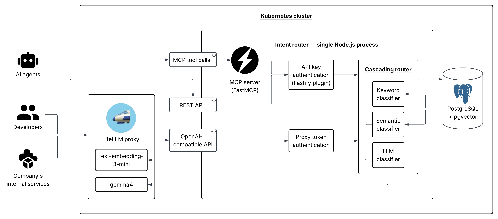
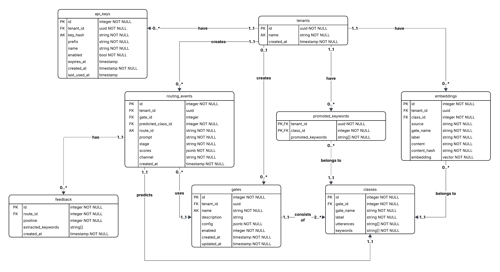
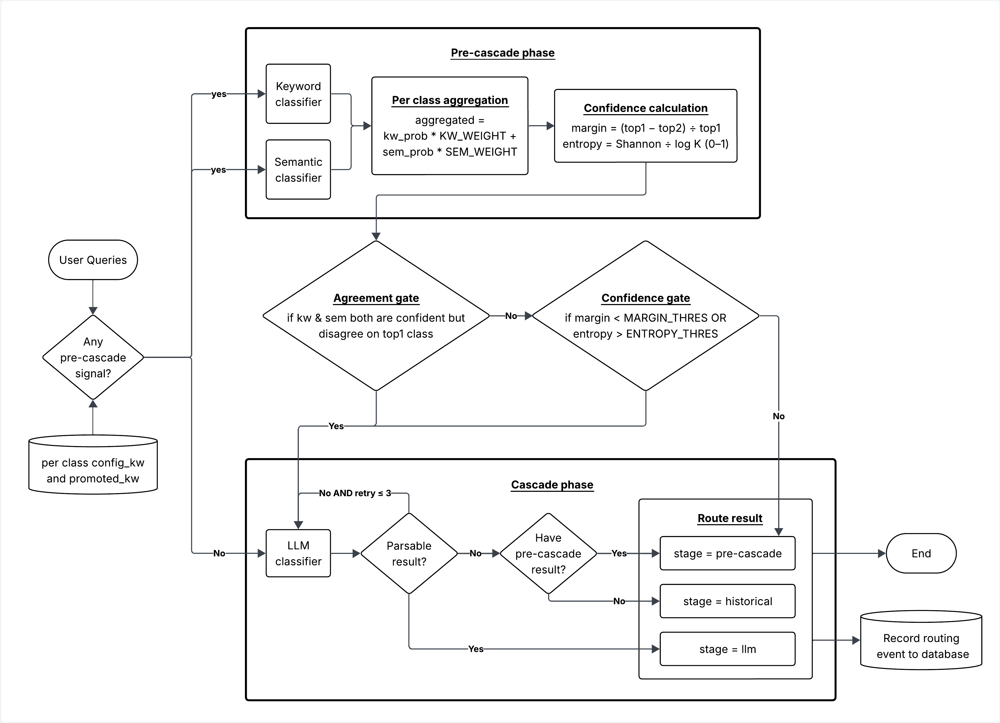
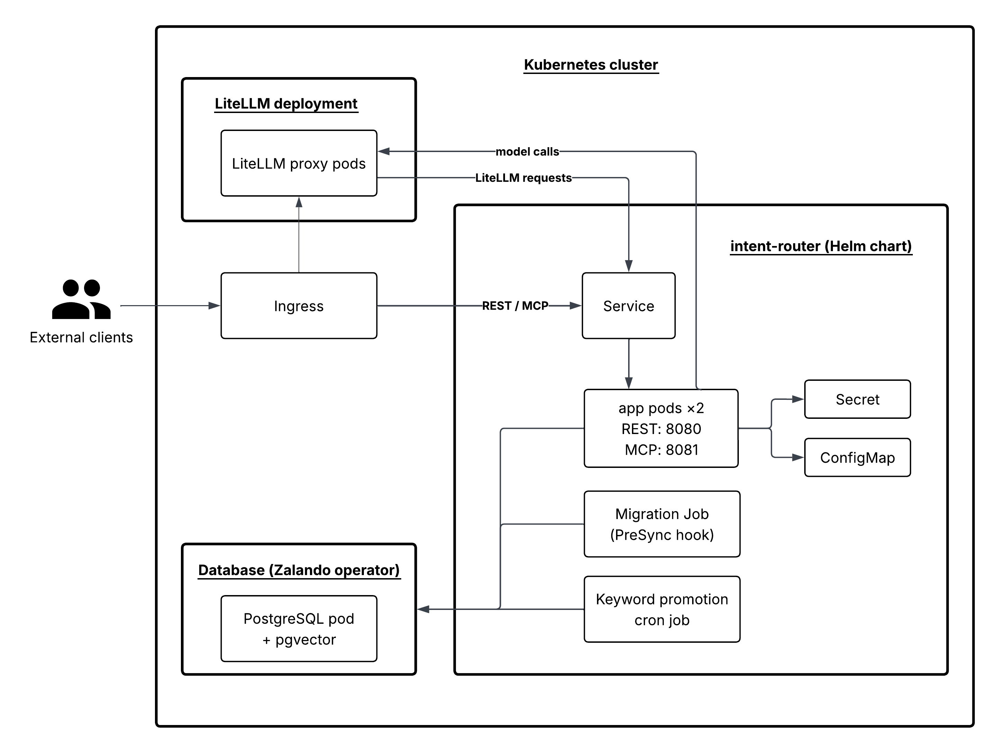

# Architecture

This document describes the system design of the intent router: its entry points, database schema,
routing pipeline, online-learning loop, and deployment. It is the design rationale behind the code;
the request/response contracts are in [`API.md`](API.md).

## Overview

The service is a single Node.js/TypeScript process containerised by Docker. It exposes its
functionality over HTTP and delegates all persistence to a PostgreSQL database with the `pgvector`
extension. Three entry points — REST, MCP, and an OpenAI-compatible surface — converge on one
service layer, routing cascade, and store:



All three entry points resolve the caller to a **tenant id** before any routing work happens. The
MCP server runs in the same process as the application (on its own port) so its tool handlers call
the shared service functions directly, avoiding a second deployment and a network hop.

External dependencies: the LiteLLM proxy plays two roles. As a *client*, it forwards
chat-completion routing requests to the router's OpenAI-compatible surface; as an *upstream
dependency*, it is the single gateway through which the router reaches the hosted language and
embedding models.

## Entry points

| Entry point | Framework | Channel (`routing_events.channel`) | Auth |
| ----------- | --------- | ---------------------------------- | ---- |
| REST        | Fastify   | `rest`                              | `Authorization: Bearer <api-key>` |
| MCP         | FastMCP   | `mcp`                               | same API-key check in `authenticate` |
| LiteLLM     | Fastify   | `litellm`                           | `intent-router-token` + `intent-router-tenant` headers |

The REST and LiteLLM surfaces are Fastify plugins registered during bootstrap; the MCP server is a
separate instance started in the same process. HTTP-facing packages follow a three-file split —
`routes.ts` (endpoints), `schema.ts` (Zod validation), `service.ts` (business logic) — while
`store/` isolates all database access behind the Drizzle schema.

## Database design

Persistence is a PostgreSQL database accessed through Drizzle ORM, pairing a relational core with
a pgvector vector store, all scoped per tenant:



- **`tenants`** roots the ownership hierarchy. UUID identifiers are used for tenants; all other
  tables use compact integer ids. Throughout the schema, `tenant_id = NULL` marks a shared,
  system-wide row.
- **`api_keys`** holds credentials for clients that do not authenticate through the LiteLLM proxy
  (hashed with SHA-256).
- **`gates`** / **`classes`** hold the routing taxonomy. `classes.gate_name` is denormalised so the
  hot-path `(gate_name, label)` lookup needs no join. `gates.config` (`jsonb`) carries per-gate
  routing configuration such as `learningEnabled`.
- **`embeddings`** stores the semantic classifier's searchable vectors, tagged by `source`
  (`config`, `pos_feedback`, or `neg_feedback`).
- **`routing_events`** is the audit trail: one row per routing request, with the deciding `stage`
  (`pre-cascade`, `llm`, or `historical`), the per-class `scores`, and the entry `channel`.
- **`feedback`** / **`promoted_keywords`** close the online-learning loop.

Ownership tables (`api_keys`, `gates`, `classes`, `embeddings`, `promoted_keywords`) use
`ON DELETE CASCADE`; the audit table uses `ON DELETE SET NULL`, so deleting a tenant, gate, or
class keeps routing history but nulls the reference. Writes that touch denormalised columns are
grouped into a single transaction.

## Routing pipeline

The cascading router chains three classifiers behind one interface, each returning a per-class
probability distribution plus the evidence behind it:

```ts
export interface Classifier {
  readonly name: ClassifierMode;
  classify(prompt: string, gate: Gate, tenantId: string): Promise<ClassificationResult>;
}
```

### Keyword classifier (cheapest)

Tokenises the prompt, drops stopwords, and scores each class as the fraction of its keywords that
appear — configured keywords weighted 2.0× against promoted keywords at 1.0×, so learned keywords
cannot drown out the configured ones.

### Semantic classifier

Embeds the prompt with the configured embedding model, runs a top-K nearest-neighbour search over
the class-utterance vectors scoped to the gate-tenant pair, and aggregates thresholded
similarities into a normalised distribution. Negative-feedback embeddings act as **veto
guardrails**: a guardrail suppresses an intent when it clears a similarity threshold and beats the
class's best positive embedding by a margin. If no neighbour clears the threshold, probability is
spread over the returned neighbours so the cascade sees honest uncertainty.

### LLM classifier (fallback)

Prompts a language model to reply with the **bare label** (no JSON schema), parsed by regex, with
up to three attempts before giving up. The label-only design avoids the reasoning degradation of
strict structured output on small, self-hosted models and sidesteps their unreliable calibrated
confidence.

### Cascade



1. Run the keyword and semantic classifiers in parallel — only those with configured signal — and
   blend their normalised distributions linearly (`kw × 0.3 + sem × 0.7`).
2. **Confidence gate:** escalate to the LLM when the relative top-1/top-2 margin is below
   `CAS_MARGIN_THRESHOLD` or the normalised entropy is above `CAS_ENTROPY_THRESHOLD`.
3. **Agreement gate:** escalate when the two classifiers are each individually confident but
   disagree on the top class.
4. If the LLM yields no usable label, degrade to the pre-cascade result, then to the
   most-frequent historical class for the (gate, tenant) pair.

A safety net short-circuits straight to the LLM when a gate has neither keywords nor utterances
configured.

## Online learning

Learning refines the two cheap classifiers only; the LLM classifier stays static. All learning is
driven by explicit user feedback (`POST /api/feedback` with a `routeId` and `positive` flag). The
feedback row is written before any learning work, and the learning steps are best-effort, so the
audit trail survives even when learning fails.

- **Keyword learning** (scheduled cron): TF-IDF over accumulated feedback promotes per-class
  keywords, gated by a precision floor and a minimum corpus size.
- **Semantic learning** (on feedback receipt): positive feedback embeds the prompt as
  `pos_feedback`; negative feedback from *confident* errors installs a `neg_feedback` guardrail.
  Writing flips any opposite-signed evidence for the same utterance so contradictory evidence
  cannot coexist.

Learned signals are down-weighted relative to configured anchors (1.0× vs 2.0×) and bounded
(`LRN_MAX_PER_CLASS`, `LRN_MIN_FEEDBACK_ROWS`) to guard against concept drift and catastrophic
forgetting.

## Deployment

The service is containerised as a single multi-stage Docker image that serves every runtime role
(the application, the one-shot migration, and the scheduled keyword-promotion job), running as a
non-root user:



Reference Kubernetes manifests ship in [`k8s/`](../k8s): a Deployment, Service, ConfigMap, Secret,
a migration Job, and a keyword-promotion CronJob. Production rollout is the client's
responsibility. A liveness probe hits `/health`; a readiness probe hits `/ready`, which
additionally checks the database. Migrations run once per release (a PreSync hook in production;
a standalone Job in the reference manifests) and take a PostgreSQL advisory lock to serialise.
